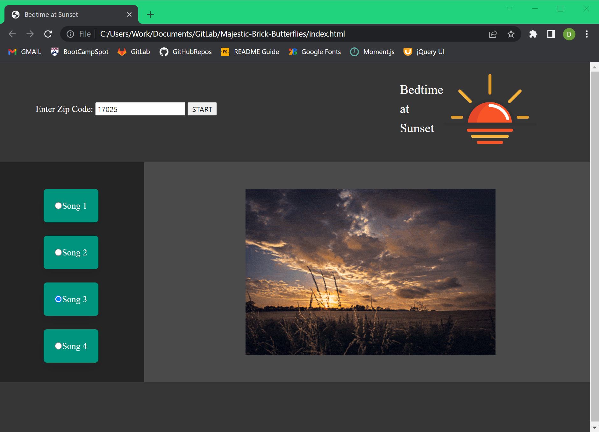
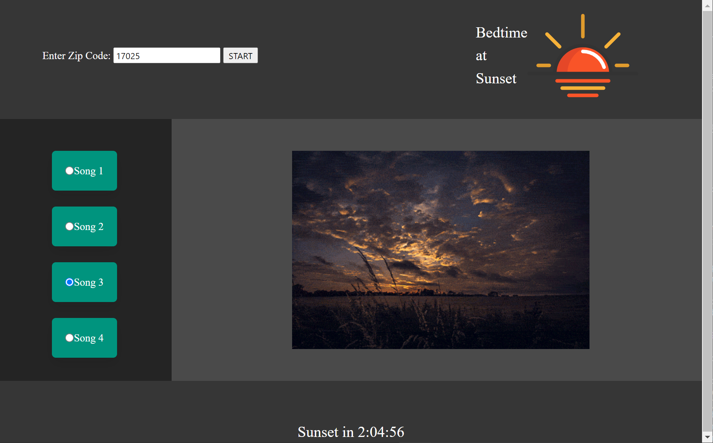
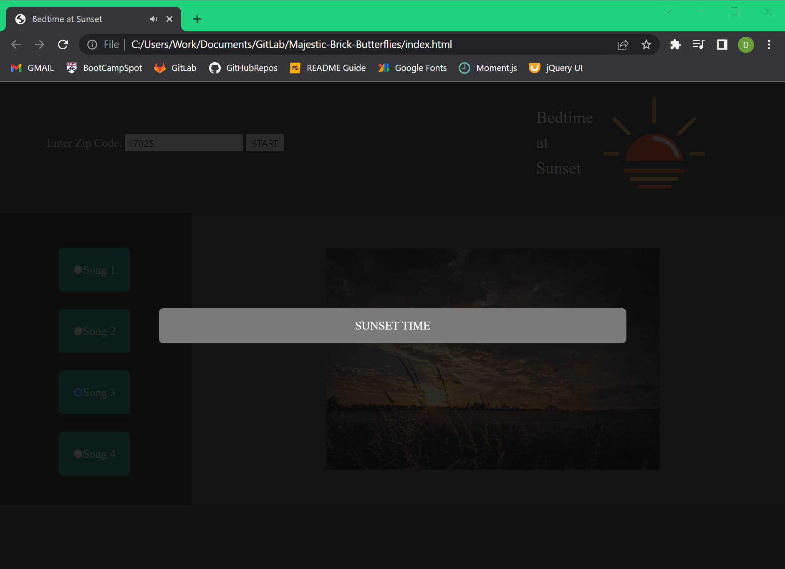
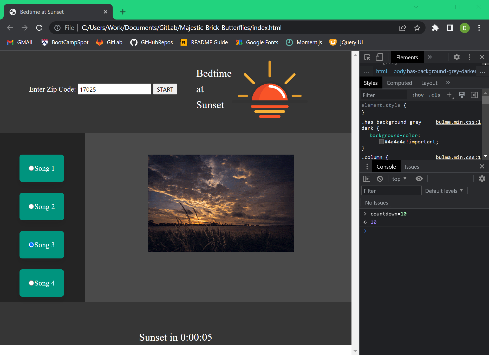

# Sunset Alarm

https://dccoppock.github.io/Majestic-Brick-Butterflies/

## Description

Many people who work at a computer screen during the day do so in windowless cubicles, offices, and basements. With no way of seeing the light of day slip away, these workers can easily lose track of time and work far later than intended. To prevent the innevitable burnout caused by over-working, office workers and basement dwellers may sometimes need a reminder to stop working when the sun goes down.

Enter the Sunset Alarm web app.

Sunset Alarm allows users to select a sound for their alarm, enter their zip code, and the app will set an alarm to go off when the sun is setting at the user's location. 

## Server-Side API's

Sunset Alarm accomplishes this by first using the api.positionstack.com geolocation API to determine the user's approximate latitude and longitude coordinates from their zip code, then feeding those coordinates to the api.sunrise-sunset.org API to determine the time of today's sunset. Once the time of the sunset is determined, a timer appears on the screen and counts down until sunset.

At sunset, a modal appears over the page and the selected alarm sound file starts to play, alerting the user that it is time for them to stop working.

## Local Storage

Sunset Alarm saves the zipcode entered by the user in the browser's local storage. If there is already a zip code saved in local storage, it appears in the zip code text input box. Any locally stored zip code is used if the text box is left blank.

Sunset Alarm also saves the user's most recent alarm sound selection in local storage and starts with that sound selected by default.

Sunset Alarm saves the latitude and longitude coordinates determined by the geolocation API and the sunset time (in milliseconds since January 1, 1970 UTC) determined by the sunrise-sunset API in local storage. When these values are available in local storage, they are used instead of utilizing the API's (NOTE: if the stored sunset time is in the past, the API is used to determine the next sunset time instead). This potentially improves performance by avoiding unnecessary fetch requests to the API's.

## Styling

Sunset Alarm utilizes the Bulma CSS framework for styling.

## Usage

The user should enter their zip code in the input text box in the upper left of the app and then press the START button.

And that's it! The app takes care of the rest. A countdown timer appears and counts down to the time of sunset. Once the countdown is complete, the user is alerted by a modal and an alarm sound playing.

## Credits

Sunset Alarm was developed by...

Jessie Rainey
https://github.com/JessieDesiree369

Martin J
https://github.com/martinr101

David Coppock
https://github.com/dccoppock

## License

MIT License

Copyright (c) [2022] [David Coppock, Jessie Rainey, Martin J.]

Permission is hereby granted, free of charge, to any person obtaining a copy
of this software and associated documentation files (the "Software"), to deal
in the Software without restriction, including without limitation the rights
to use, copy, modify, merge, publish, distribute, sublicense, and/or sell
copies of the Software, and to permit persons to whom the Software is
furnished to do so, subject to the following conditions:

The above copyright notice and this permission notice shall be included in all
copies or substantial portions of the Software.

THE SOFTWARE IS PROVIDED "AS IS", WITHOUT WARRANTY OF ANY KIND, EXPRESS OR
IMPLIED, INCLUDING BUT NOT LIMITED TO THE WARRANTIES OF MERCHANTABILITY,
FITNESS FOR A PARTICULAR PURPOSE AND NONINFRINGEMENT. IN NO EVENT SHALL THE
AUTHORS OR COPYRIGHT HOLDERS BE LIABLE FOR ANY CLAIM, DAMAGES OR OTHER
LIABILITY, WHETHER IN AN ACTION OF CONTRACT, TORT OR OTHERWISE, ARISING FROM,
OUT OF OR IN CONNECTION WITH THE SOFTWARE OR THE USE OR OTHER DEALINGS IN THE
SOFTWARE.

## Tests

It can be tricky to test the audio and alarm functionality of Sunset Alarm since it may require waiting hours for the alarm to go off. To test this functionality more conveniently, the user should enter their zip code, and press the START button. Once the countdown timer appears, the user should open their browser's console, type

<code>countdown = 10</code>

and press enter. This will set the alarm to go off in 10 seconds.

